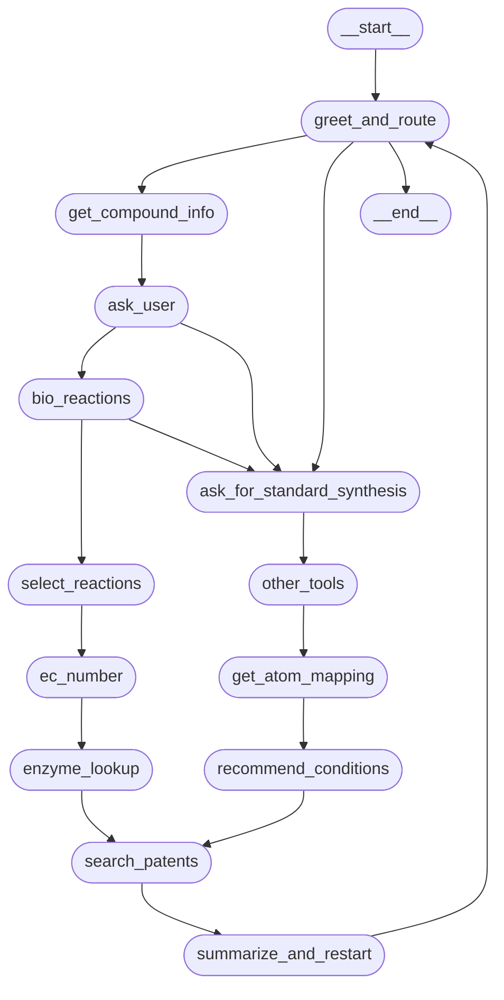

---

````markdown
# 🧪 LLM-Based Retrosynthesis Agent with Biocatalysis

An intelligent retrosynthesis planner built with LangGraph + LLMs, integrating biocatalysis, enzyme reasoning, and patent search to enable explainable and scalable synthesis planning.

---

## 🚀 Features

- ✅ LLM-guided retrosynthetic planning (from name or SMILES)
- 🔬 Biocatalytic reaction prediction (RetroBioCat)
- 🧬 EC number + enzyme prediction with FASTA retrieval
- 🧠 Atom mapping + reaction condition inference
- 📄 Similar patent search with LLM-based similarity reasoning
- 🧾 Summary generation in YAML/Markdown
- 🔗 Future: AlphaFold/Boltz integration for structure validation

---

## 📦 Setup

```bash
git clone https://github.com/boltzmannlabs/Hackathon_june25.git
cd synagent
conda create -n langgraph_env python=3.9 -y
conda activate langgraph_env
pip install -r tools/CLAIRE/requirements.txt
pip install -e tools/CLAIRE/rxnfp/
pip install -r tools/RetroBioCat_2/
pip install -e tools/OpenNMT
pip install rxnmapper
````

---

## 🧠 Usage

```bash
python main.py.py 
```
---

## ⚙️ Architecture



---

## 🔭 Roadmap

* AlphaFold/Boltz enzyme validation
* UI (Gradio/Streamlit)
* Wet-lab protocol + synthesis cost estimation

---

## 📄 License

MIT

---

## 📬 Contact

[joel@boltzmann.co](mailto:yourname@youremail.com)

```
